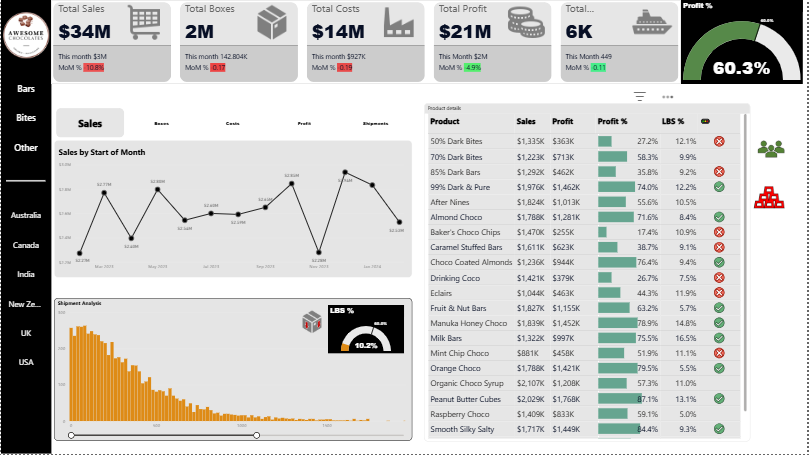
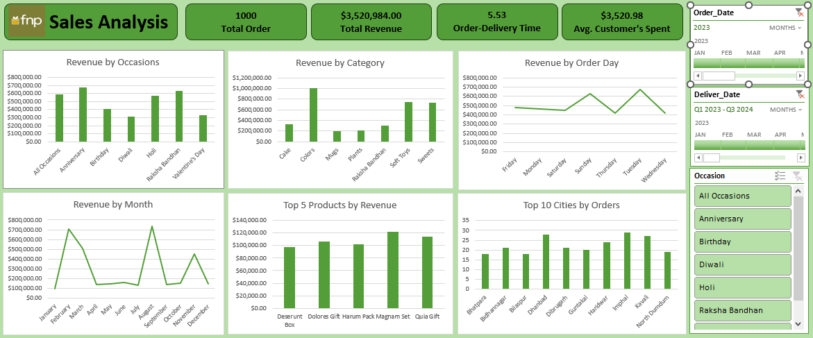

# PowerBI
Sample Power BI Dashboards:

Project 1 :
===========
See full Dashboard here :

🚀 Coco Chocolate Sales Analytics Dashboard - Powered by Power BI 🍫

I’m excited to share an interactive Power BI dashboard I created to provide comprehensive sales analysis for Coco Chocolate. This dashboard visually presents key metrics and insights, including:

1. Revenue, total boxes sold, profit, and shipment count.
2. Detailed performance breakdown by product and salesperson.
3. Analysis of low box shipment counts, including percentages.
4. Month-over-Month (MoM) and Year-over-Year (YoY) growth comparisons.

This project allowed me to enhance my skills in advanced visualization techniques, KPI tracking, interactive filters/slicers, and data storytelling within Power BI.

🔧 Tools Used: Power BI Desktop, DAX, Excel
🔑 Skills Highlighted: Data Modeling, Interactive Visuals, KPI Tracking

# Excel 
Sample Excel Dashboards :

Project 2 :
============
See full Dashboard here : 

Summary – FnP Sales Analysis Dashboard :
This dashboard provides a 360° view of FnP’s sales performance across orders, revenue, delivery times, products, categories, and locations for the selected period. The visual breakdown enables quick identification of trends, top performers, and improvement areas.

Key Performance Indicators (KPIs) :

Total Orders: 1,000
Total Revenue: $3,520,984
Average Order-Delivery Time: 5.53 days
Average Customer Spend: $3,520.98

These KPIs reflect a high-value order base with relatively short delivery timelines for a gifting business.

Revenue Insights :
1. By Occasion

Highest Revenue Occasions:
Anniversary ($700K) and Holi ($650K) are top performers.
Lowest Revenue Occasions:
Birthday ($350K) and Valentine’s Day ($300K) lag behind.
Interpretation: Stronger festive-event sales (Holi, Raksha Bandhan) compared to personal events like birthdays.

2. By Category

Cakes dominate the product mix, generating over $1.1M.
Soft Toys ($700K) and Sweets ($650K) are strong contributors.
Plants and Mugs are least profitable (~$300K each).
Interpretation: Cake is the flagship category; scope exists to cross-sell from high-revenue items to low-performing categories.

3. By Order Day

Top Days: Tuesday ($700K) and Saturday ($600K) drive higher sales.
Lowest Day: Friday (~$500K).
Interpretation: Midweek and weekend peaks suggest customer purchase cycles influenced by celebration planning.

4. By Month

Peaks: February ($700K) and September ($720K) align with major gifting seasons (Valentine’s week, festive periods).
Lows: May, June, October show dips in demand.
Interpretation: Seasonal promotions can smoothen monthly sales gaps.

Top Products & Cities :

1. Top 5 Products by Revenue :
Leaders: Harum Pack Magman Set ($125K) and Quia Gift ($115K).
Lowest among top 5: Deserunt Box (~$90K).
Interpretation: A few premium SKUs contribute disproportionately to total sales.

2. Top 10 Cities by Orders :
Highest Orders: Dhanbad (~30 orders) and Imphal (~29 orders).
Lowest among top 10: Bhatpara (~18 orders).
Interpretation: Sales distribution is uneven across locations; potential to scale in mid-tier cities.

Operational Insight – Order Quantity vs Delivery Time :

Correlation Value: 0.003478174
Meaning: No measurable relationship between the size of an order and the delivery time.
Implication: Fulfilment efficiency is maintained regardless of order quantity, which can be leveraged in marketing to encourage bulk orders without delivery delay concerns.

Recommendations to Implement from Dashboard :

1. Boost Underperforming Occasions: Launch targeted offers for Birthdays and Valentine’s Day to diversify revenue sources.
2. Product Diversification: Expand the variety in Cakes, Soft Toys, and Sweets to maintain leadership while uplifting Mugs and Plants sales.
3. Promote on Low-Sales Days: Introduce Friday-specific deals to balance weekday performance.
4. Seasonal Gap Filling: Plan marketing campaigns in low-demand months (May, June, October) to stabilize revenue flow.
5. City-Focused Growth: Use localized advertising and regional partnerships in mid-tier cities to expand customer base.
